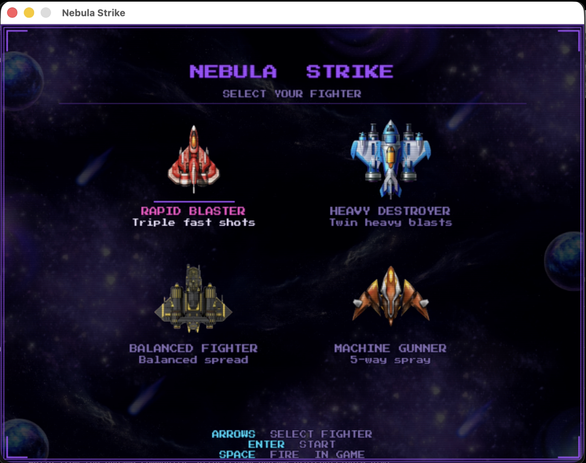
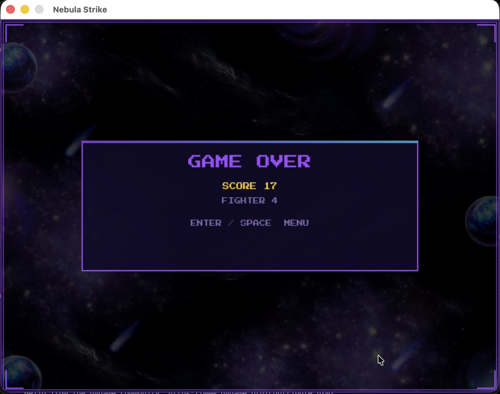

# Nebula-Strike
# 🌌 Nebula Strike  
> *A retro-inspired arcade space shooter built with Python & Pygame*


---

## 🚀 Overview

Nebula Strike is a fast-paced 2D space shooter where you pilot powerful fighters, dodge enemy fire, and survive increasingly difficult waves.

Designed with a **neon retro aesthetic**, the game combines classic arcade vibes with modern gameplay mechanics.

---

## 🎮 Features

- 🚀 Multiple fighters with unique shooting styles  
- ⚡ Dynamic difficulty scaling  
- 🤖 Enemy AI with shooting mechanics  
- 💥 Real-time collision detection  
- 🛡️ Power-ups system:
  - Rapid Fire  
  - Shield  
  - Extra Life  
- 🌈 Neon / CRT-inspired UI  

---

## 🕹️ Gameplay

- Control your spaceship and destroy enemies  
- Dodge bullets and survive as long as possible  
- Collect power-ups for advantage  
- Score increases with survival + kills  

---

## 🛠️ Tech Stack

- **Languages:**
  - Python  
  - HTML  

- **Game Development:**
  - Pygame  

- **Concepts:**
  - Object-Oriented Programming  
  - Game Loop  
  - Collision Detection  
  - Basic AI Logic  

---

## 📸 Screenshots

> *(Add your gameplay images below — just replace file names if needed)*

### 🎬 Menu Screen


### 🚀 Gameplay


### 💥 Combat Scene


### ☠️ Game Over


---

## ⚙️ Installation

```bash
git clone https://github.com/mahiizg/Nebula-Strike.git
cd Nebula-Strike

pip install pygame

python main.py
